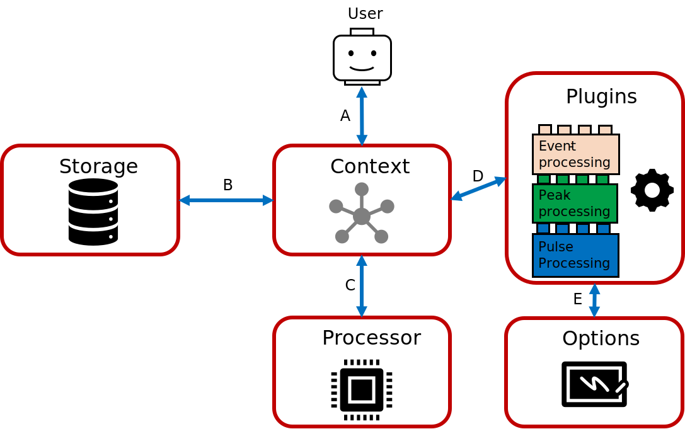

Using strax
================

Strax is centralized around a centralized class: the `Context`. Users interact with the context to process and request data.
On this page, we will build up an example context from scratch and how to interact with this context.

A user will always interact with the context, after which the context will figure out the required action to perform such as loading data from disk, or processing data newly.

To start a new context, initialize the class from strax:

.. code-block:: python

    >>> import strax

    >>> context = strax.Context()

At this point, we still need to add the plugins and storage (explained below) to use the context.

Plugins
-------------
To a context several classes are registered that are responsible for processing/generating the data. In the example-figure above, we have three plugins:

 - PulseProcessing
 - PeakProcessing
 - EventProcessing

Let's start by adding the first plugin (``PulseProcessing``):

.. code-block:: python

    >>> import strax
    >>> from strax.testutils import Records as PulseProcessing
    >>> context = strax.Context(register = [PulseProcessing],
                                storage = [],  # We will explain the storage below
                               )
    >>> print(f'Our context provides the following data-types {context.provided_dtypes().keys()}')
    Our context provides the following data-types dict_keys(['records'])

Now one can load data via the context (because our PulseProcessing plugin provides new data at request)

.. code-block:: python

    >>> pulses = context.get_array(run_id = 'some_run',
                                   targets = 'records',)
    >>> len(pulses)
    100

You can see that in the figure above, we asked for data at **A**, at which point the context checked which plugin was responsible for generating the data `'records'`, processed this data (**C**) and returned the data back to the user (**A**).

This data is not stored, but generated on the fly:

.. code-block:: python

    >>> pulses = context.is_stored(run_id = 'some_run', target = 'records',)
    False

Storage
-------------
If we want to add one or more storage-sites, we can do this while creating our context (using the ``storage`` keyword argument we specified as ``storage=[]`` above) or by adding storage later:

If we now add a storage site (which is called a storage frontend, see the developer documentation) we can check again if the data is stored.
Just after adding the storage site, the data is not stored.
However, If we now ask for data again, we will see that the context will again process the data (**C**) and will appart from returning it only to the user (**A**), also store it to disk (**B**).
The next time a user will request this data, the context will load it directly from disk.

.. code-block:: python

    >>> my_storage_site = strax.DataDirectory('./strax_data')
    >>> context.storage.append(my_storage_site)
    >>> context.is_stored(run_id = 'some_run', target = 'records',)
    False
    >>> pulses = context.get_array(run_id = 'some_run',
                                   targets = 'records',
                                  )
    >>> context.is_stored(run_id = 'some_run', target = 'records',)
    True

Options
-------------

Plugins take options (also see the advanced documentation on plugins and configs). A basic plugin to do PeakProcessing could look like this:

.. code-block:: python
    import numpy as np

    class PeakProcessing(strax.Plugin):
        """Base every peak on a record, and make all peaks of the same type"""
        __version__ = '0.0.0'

        # Which input is this plugin based on
        depends_on = 'records'

        # Which data type does the plugin provide
        provides = 'peaks'

        # A configuration option, which we can use in the computation (self.compute)
        peak_type = strax.Config(default=1,
                                 type=int,
                                 help='Classifify all records as this type of peak'
                                 )

        # The numpy-dtype of the output
        dtype = strax.peak_dtype()

        def compute(self, records):
            """Compute the peaks based on the records"""
            result = np.zeros(len(records), dtype=self.dtype)

            # Use the 'peak_type' config to set the type of this data
            result['type'] = self.config['peak_type']

            # Strax always needs time fields, see advanced documentation
            result['time'] = records['time']
            result['dt'] = records['dt']
            result['length'] = records['length']

            return result

    >>> context.register(PeakProcessing)

Now we can load peaks just as we did for our records-data. Because of the ``peak_type`` configuration, we can now test that all the data is of the same type:

.. code-block:: python

    >>> peaks = context.get_array('some_run', targets='peaks')
    >>> assert np.all(peaks['type']==1)

Strax tracks options via the "lineage" of a plugin, by bookkeeping the options, with which data was processed.
Let's have a look what this looks like for our current context:

.. code-block:: python
    >>> peak_processing = context.get_single_plugin(run_id='some_run', data_name='peaks')
    >>> peak_processing.lineage
    {'peaks': ('PeakProcessing', '0.0.0', {'peak_type': 1}),
     'records': ('Records', '0.0.0', {'crash': False, 'dummy_tracked_option': 42})}

We can see that for ``peaks``, this lineage contains the ``peak_type``-option (and it's value).
Additionally, we see that this lineage also contains the name of the plugin providing the data (``'PeakProcessing'``),
the version number (``'0.0.0'``) as well as the same information for the lower-lying plugin ('records')
for which it also shows the plugin-name, plugin-version and plugin-configurations.

We can also change the options set in plugins, again, using the context:

.. code-block:: python

    >>> context.set_config(dict(peak_type=2))
    >>> peak_processing = context.get_single_plugin(run_id='some_run', data_name='peaks')
    >>> peak_processing.lineage
    {'peaks': ('PeakProcessing', '0.0.0', {'peak_type': 2}),
     'records': ('Records', '0.0.0', {'crash': False, 'dummy_tracked_option': 42})}

If we now request data again, the context will check if the plugin with this configuration is stored, and since this is not the case, recompute it.

.. code-block:: python

    >>> peaks = context.get_array('some_run', targets='peaks')
    >>> assert np.all(peaks['type']==2)

We will now see that if we check the data-folder, there are two versions of the data! One for each configuration of our option ``peak_type``

.. code-block:: python

    >>> import os
    >>> os.listdir('./strax_data')
    ['some_run-peaks-3g2rc4f3jg',
     'some_run-peaks-vqo4oamp76',
     'some_run-records-j3nd2fjbiq']

Strax will create a hash for the ``lineage`` as in the examples above. Which is different when whe changed the ``peak_type`` in our examples above.
You can check the lineage e.g. by using the ``context.key_for`` method (which computes the lineage and corresponding hash for the requested datatype:

.. code-block:: python

    >>> context.set_config(dict(peak_type=1))
    >>> print(context.key_for(run_id='some_run', target='peaks'))
    >>> context.set_config(dict(peak_type=2))
    >>> print(context.key_for(run_id='some_run', target='peaks'))
    some_run-peaks-3g2rc4f3jg
    some_run-peaks-vqo4oamp76

For more examples, checkout the developer and advanced documentation.