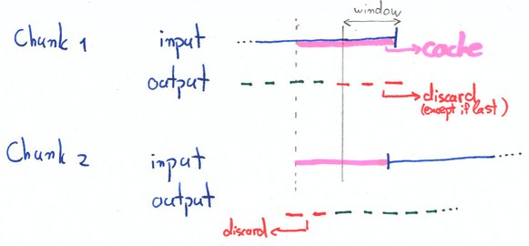

Chunk boundary handling
========================

Many algorithms need to look back and ahead in the data. For example, we want to group nearby PMT pulses together into peaks.
Or, to ensure non-overlapping events, we want to group triggers with others that occur just before or ahead.

During online processing, however, not all data is available. How can you look ahead if the data has not been acquired?
Even during offline processing, you may not be able to keep all data of a given type for a run into RAM.

Overlap window plugins
-----------------------

Strax includes the `OverlapWindowPlugin` to deal with this case. To use it, specify a **window size**: a maximum duration which the algorithm needs to look back or ahead. Then write your algorithm as if there are no chunk breaks -- everything will be taken care of behind the scenes.

The illustration below shows how `OverlapWindowPlugin` works. Imagine this is a event finder plugin, which finds events (green and red dashes) in a stream of peaks (continuous blue line).

* Outputs too close to the end of a chunk are discarded, except for the last chunk. When a chunk arrives, it is generally not known to be the last, so we keep this data around internally and emit it once we get word there will be no more chunks.
* Inputs close to the end of a chunk (pink region) are cached, and added to the input for the next chunk. Note we must cache *two* windows of input: to interpret data at (end - one window) we need all data from (end - two windows) to (end).
* For the next chunk, outputs fully in the region between (end - window) and (end) of the previous chunk are discarded. These are invalid, and moreover, we sent out the valid ouputs for that range during the previous chunks.

Note from the figure that outputs straddling (end - window) are initially discarded; they are recomputed during the next chunk.

If the endtimes of two objects are separated by more than a window size, they must be guaranteed to not influence each other. If your algorithm does not have this guarantee, you cannot use `OverlapWindowPlugin` and must implement a custom solution. Make sure your window is large enough so this guarantee holds even if the objects themselves have a relevant length.

Chunk breaks and the DAQ reader
--------------------------------

Low-level datastreams are too large to be routed through a single core. Instead, each CPU sees only a chunk of data. However, the `OverlapWindowPlugin` will not work, because it keeps has state (the cached input, and the temporarily cached output), it cannot be parallelized.

For the low-level datastream, we take a different approach

TODO: document pre- and post-chunk stuff here.